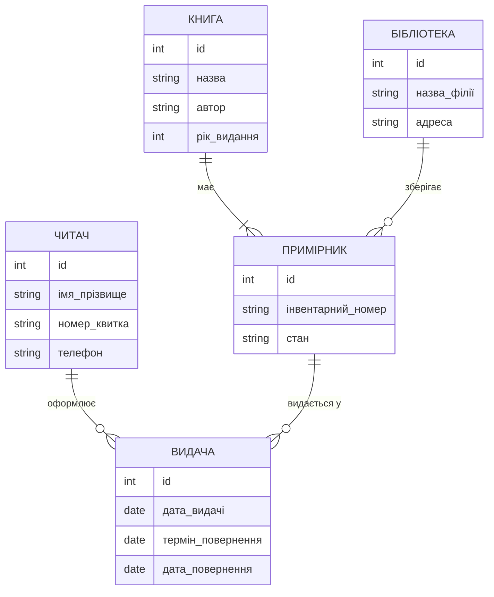

# ER-модель бібліотеки

```mermaid
erDiagram
    КНИГА ||--|{ ПРИМІРНИК : "має"
    БІБЛІОТЕКА ||--o{ ПРИМІРНИК : "зберігає"
    ЧИТАЧ ||--o{ ВИДАЧА : "оформлює"
    ПРИМІРНИК ||--o{ ВИДАЧА : "видається у"

    ЧИТАЧ {
        int id
        string імя_прізвище
        string номер_квитка
        string телефон
    }
    КНИГА {
        int id
        string назва
        string автор
        int рік_видання
    }
    ПРИМІРНИК {
        int id
        string інвентарний_номер
        string стан
    }
    БІБЛІОТЕКА {
        int id
        string назва_філії
        string адреса
    }
    ВИДАЧА {
        int id
        date дата_видачі
        date термін_повернення
        date дата_повернення
    }
```
